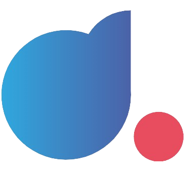
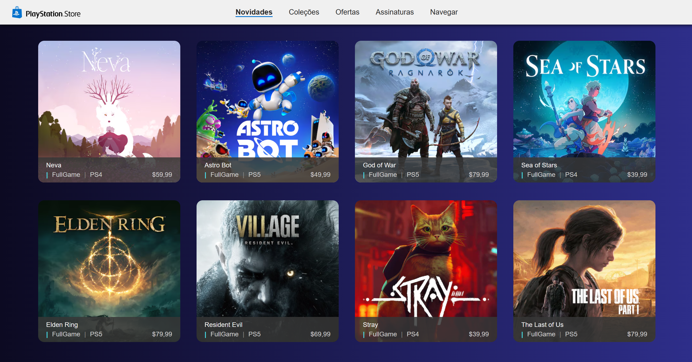

  

	
<h4 align="center"> 
	🚀 Recriação Playstation Store | Formação Angular Developer - DIO
</h4>

  

  
  
  

<h2 align=left> 💻 Sobre o projeto </h3>

 Página feita durante a <strong>Formação Angular Developer</strong> da <a href="https://web.dio.me"> <strong>DIO</strong> </a>. É um projeto onde recriamos uma página simples da Playstation Store para demonstração de conceitos e estudos de componentes e rotas no Angular.

  
<h2 align=left> 🛠 Tecnologias utilizadas </h3>

  
  
  
  

<h2 align=left> 🎨 Layout </h2>

<h4>💻 Desktop </h4>

